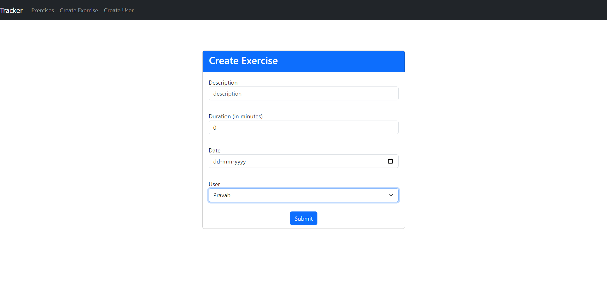
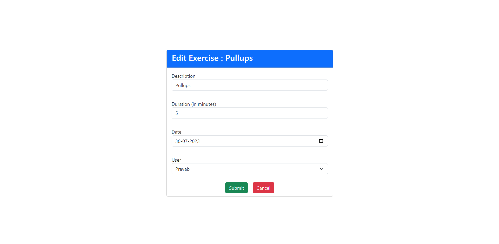
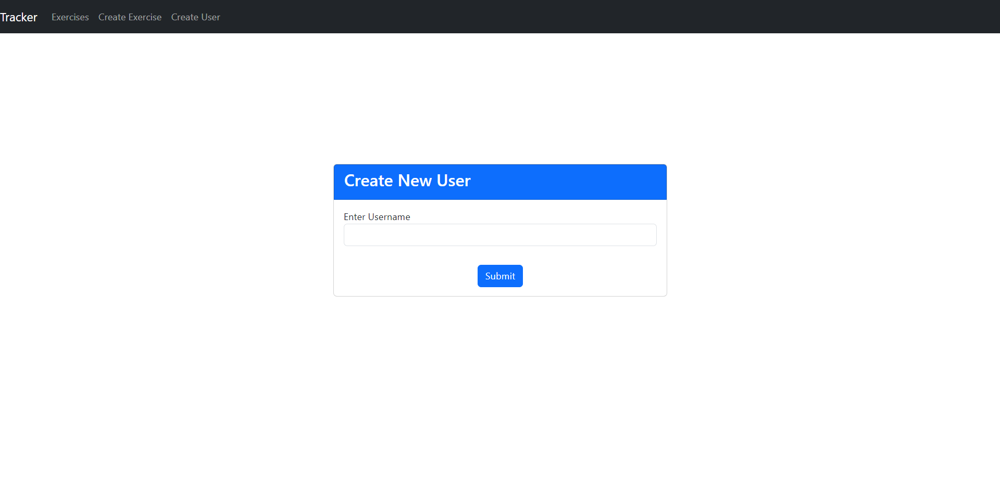

# ExerciseTracker
Exercise Tracker is an exercise tracking app designed to empower fitness enthusiasts of all levels to track their fitness goals.


# Demo
### List Exercises


### Create Exercise


### Edit Exercise


### Create User



# Installation

### Clone the project

```bash
  git clone https://github.com/PravabKar/ExerciseTracker.git
  cd ExerciseTracker
```

### Add Enviroment variables
    
```bash
  cd server
  vi .env
```

`ATLAS_URL=<YOUR_MONGODB_URL>`


### Run server (make sure you have node installed)
```bash
  node server
```

### Install the project with npm
(From another terminal)
```bash
  cd client
  npm install
```

### To run in Devlopement build

```bash
  npm start
```

OR
### To run in Production build

```bash
  npm run build
  npm run start
```

